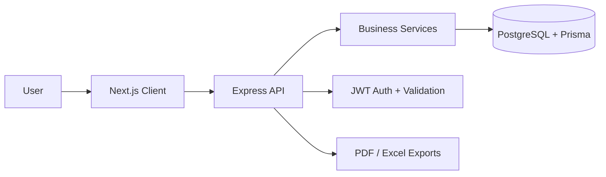

# SmartERP

<div align="center">
  
</div>

<p align="center">
  
  
  
  
  
  
  
</p>

> SmartERP is a polished, full-stack Enterprise Resource Planning application crafted to streamline company operations with a strong focus on accounting-style vouchers, inventory movement, and modern user experience.

## Why this project stands out

- A complete end-to-end business workflow from authentication to company setup, ledger management, stock control, and voucher processing.
- A clean separation between a high-quality Next.js frontend and a modular Express backend.
- A database-driven architecture using Prisma and PostgreSQL for reliable business data handling.
- Designed with the mindset of a production-grade portfolio project: structure, scalability, security, and maintainability.

## Core business modules

- Authentication and role-aware access
- Multi-company organization support
- Ledger and party management for customers, suppliers, banks, and cash
- Voucher workflows for sales, purchase, receipt, payment, and contra entries
- Stock inventory with quantity tracking and inventory logs
- Reporting and export-oriented business operations

## System architecture



## Tech stack

| Layer | Technology |
|---|---|
| Frontend | Next.js 16, React 19, Tailwind CSS, Zustand |
| Backend | Node.js, Express, JWT, Zod |
| Data | Prisma ORM, PostgreSQL |
| Utilities | Axios, ExcelJS, PDFKit, Lucide Icons |
| Quality | ESLint, Vitest, Supertest |

## Project structure

```text
SmartERP/
├── client/          # Modern Next.js frontend experience
├── server/          # Express + Prisma API and business logic
├── readme.md        # Full application overview
└── package-level docs and setup files
```

## Quick start

### 1) Start the backend

```bash
cd server
npm install
npm run dev
```

### 2) Start the frontend

```bash
cd client
npm install
npm run dev
```

Then open:

- Frontend: http://localhost:3000
- Backend API: http://localhost:10000

## What makes it impressive

- A real-world ERP-style domain model rather than a toy demo
- Strong modular backend services for invoices, vouchers, stock, and reporting
- Careful attention to business logic, validation, and maintainable architecture
- A polished UI experience designed to feel like a serious internal business tool

## Future enhancements

- Advanced reporting dashboards
- Role-based permissions and audit logs
- PDF invoice generation refinements
- Multi-currency and multi-branch support
- Admin analytics and workflow automation

---

Built with intent, clarity, and a strong product mindset. SmartERP is designed not just to function, but to impress.
